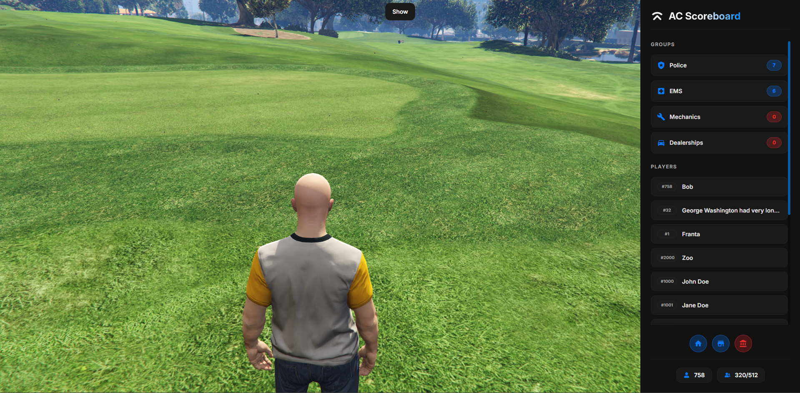

## Introduction
**AC Scoreboard** is the ultimate scoreboard solution for your server.

Ditch the unpleasant default scoreboard that comes with your framework and give your players something nice, clear and useful.

This is a new, completely rewritten version of the very popular scoreboard that you have enjoyed using since 2022. While keeping the same iconic layout, you can look forward to new features such as status indicators or ACE permissions.

You can use one of the supported framework to enable additional features such as group list.  
Supported frameworks are [ox_core](https://github.com/communityox/ox_core), [qbx_core](https://github.com/Qbox-project/qbx_core), [qb-core](https://github.com/qbcore-framework/qb-core) and [es_extended](https://github.com/esx-framework/esx_core).

---

## 🎨 Optimized & Redesigned Version

This is an optimized and redesigned fork of the original [AC Scoreboard](https://github.com/acscripts/ac_scoreboard) by [AC Scripts](https://github.com/acscripts).

---

### ✨ What's New in This Version

#### 🚀 Performance Optimizations

- **Intelligent Caching System**: Implemented a sophisticated caching mechanism for player data that only rebuilds when necessary:
  - Cache invalidates only when players join/leave
  - Cache updates on job changes (`OnJobUpdate` / `esx:setJob`)
  - Cache updates on duty status changes (`SetDuty`)
  - No more rebuilding the entire player array on every menu open - significantly improves performance on high player count servers

- **Smart Player Filtering**: Added `onDutyRequired` configuration option for groups
  - Jobs like police/ambulance only show players when they're on-duty
  - Other jobs (mechanic, cardealer, etc.) show all online players
  - Automatic cache invalidation when duty status changes

- **Event-Driven Updates**: Optimized event handlers that check player visibility before invalidating cache

#### 🎨 Complete UI Redesign

- **Modern Material Design**: Complete redesign with a sleek Material black theme
  - Dark background (#121212) for better contrast
  - Blue accent color (#098bfd) for highlights and interactive elements
  - Improved card-based layout with better spacing

- **Enhanced UI Components**:
  - Player ID displayed before name for better visual hierarchy
  - Modern rounded cards with smooth hover transitions
  - Improved typography and spacing throughout
  - Enhanced status indicators with better visual feedback
  - Polished footer with improved button styling
  - Search functionality to filter players by ID or name

#### 🔧 Bug Fixes & Improvements

- Improved player card layout consistency
- Better hover states without problematic CSS effects
- Optimized scrollbar styling to match theme

---

## Features
- Customizable title (server name and logo)
- Group list with each group's player count
- Player list with their server ID (fixed-width alignment)
- Status indicators that can be used for anything (e.g. if players can rob stores)
- Select on which side of the screen is the scoreboard
- Customizable UI settings (close behavior)
- Choose what parts should be visible, based on ACE permissions
- Total player count and copyable server ID
- **NEW**: `onDutyRequired` config option for per-group duty filtering
- **NEW**: Optimized performance with intelligent caching
- **NEW**: Search players by ID or name

## Dependencies
- [ox_lib](https://github.com/communityox/ox_lib) (3.27.0+)

## Installation

1. Download or clone this repository
2. Place it in your `resources` folder
3. Build the UI:
   ```bash
   cd web
   npm install
   npm run build
   ```
4. Configure `config.lua` to your preferences
5. Add `ensure ac_scoreboard` to your `server.cfg`
6. Restart your server

## Configuration

### New Configuration Options

In `config.lua`, you can now set `onDutyRequired` for each group:

```lua
groups = {
    {
        label = 'Police',
        groups = {'police'},
        includeOffDuty = false,
        onDutyRequired = true,  -- Only shows players when on-duty
        icon = 'ic:round-local-police',
    },
    {
        label = 'Mechanics',
        groups = {'mechanic'},
        includeOffDuty = true,
        onDutyRequired = false,  -- Shows all online players
        icon = 'mdi:wrench',
    },
}
```

- `onDutyRequired = true`: Only adds players to the scoreboard when they're on-duty (perfect for police, ambulance, etc.)
- `onDutyRequired = false`: Shows all players with that job regardless of duty status (perfect for mechanics, car dealers, etc.)

## Showcase



## Documentation
For original documentation, visit: ➡️ [docs.acscripts.dev/scoreboard](https://docs.acscripts.dev/scoreboard) ⬅️

## Performance

This optimized version significantly improves performance on servers with high player counts:

- **Before**: Player array rebuilt on every menu open (64+ iterations per open)
- **After**: Cache only rebuilds when players actually join/leave or change jobs/duty status
- **Result**: Faster menu opens, reduced server load, smoother gameplay

---

## Credits & License

### Original Developers
- **AC Scripts** - Original creator and maintainer
- Original Repository: [github.com/acscripts/ac_scoreboard](https://github.com/acscripts/ac_scoreboard)
- Original Copyright © 2024 AC Scripts

### This Fork
This version includes optimizations and UI redesigns while maintaining full compatibility with the original features.

---

## Copyright
Copyright © 2024 AC Scripts (<https://github.com/acscripts>)

This program is free software: you can redistribute it and/or modify
it under the terms of the GNU General Public License as published by
the Free Software Foundation, either version 3 of the License, or
(at your option) any later version.

This program is distributed in the hope that it will be useful,
but WITHOUT ANY WARRANTY; without even the implied warranty of
MERCHANTABILITY or FITNESS FOR A PARTICULAR PURPOSE.  See the
GNU General Public License for more details.

You should have received a copy of the GNU General Public License
along with this program.  If not, see <https://www.gnu.org/licenses/>.
